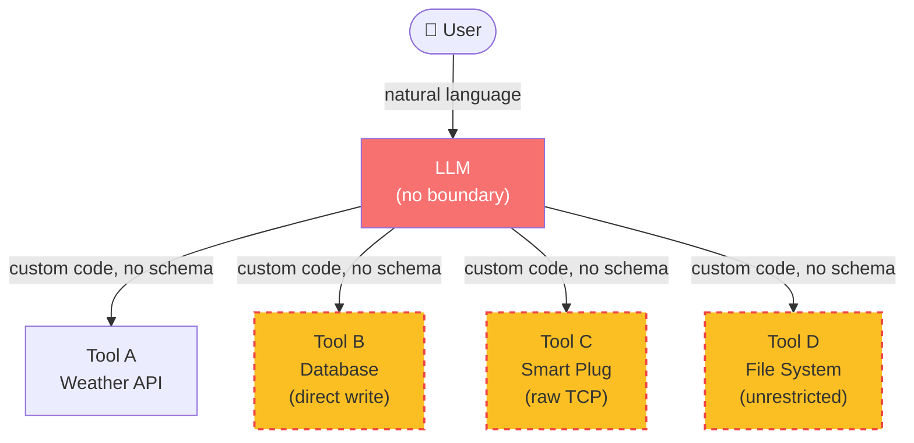
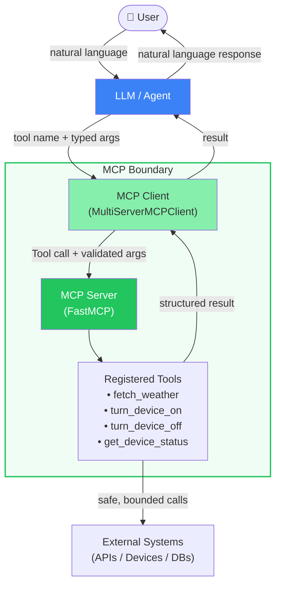
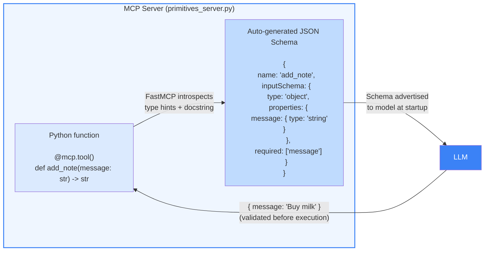
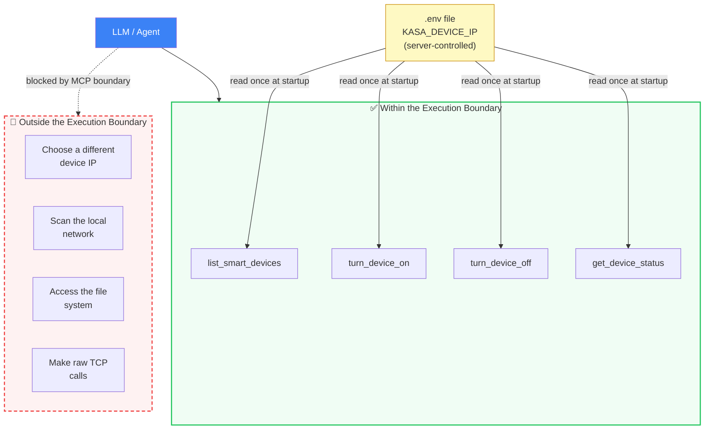
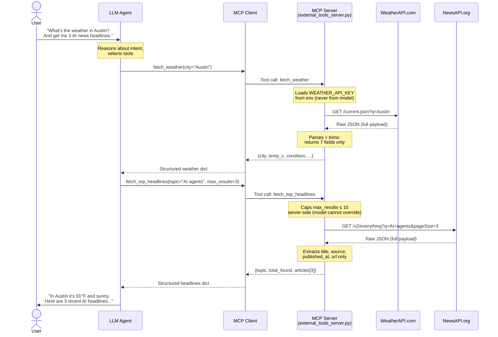
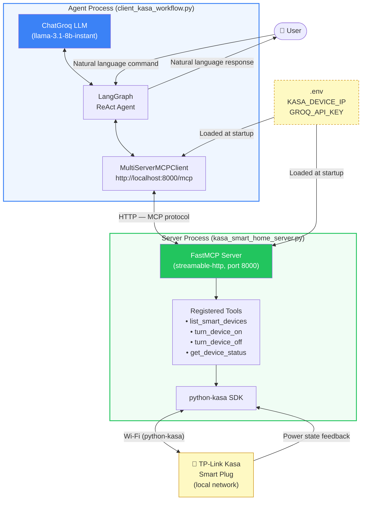
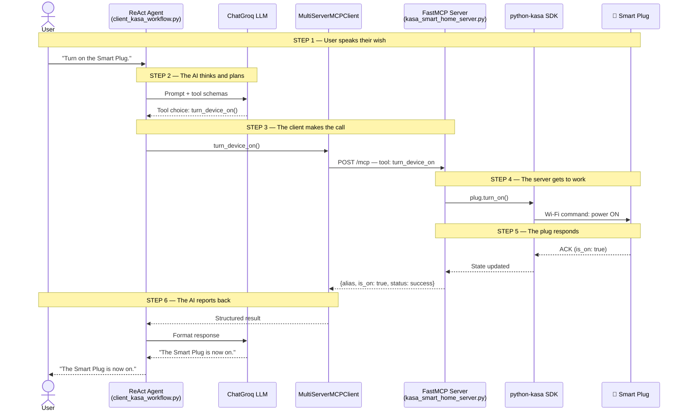
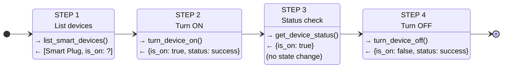
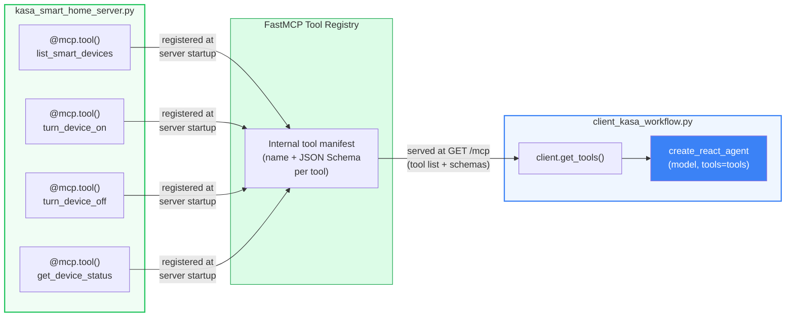
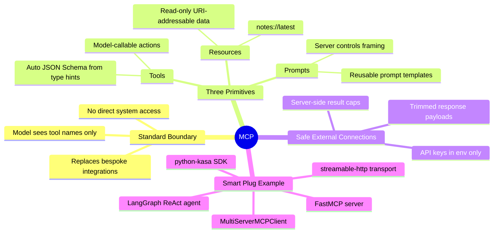

# Chapter 8 — Workflow Diagrams

This file contains Mermaid diagrams for each section of **Chapter 8: The Model Context Protocol (MCP)**.
Each diagram is self-contained and can be dropped directly into the corresponding section of the manuscript.

---

## Section 8.1 — Why Tool Use Needs a Standard Boundary

> **Diagram 8.1a — The Problem: No Standard, No Safety**
>
> Shows what happens when agents call tools directly without a protocol boundary —
> each integration is bespoke, there is no validation, and the model can trigger
> anything. Use this as the "before" picture to motivate MCP.

> **Diagram 8.1b — The Solution: MCP as a Standard Boundary**
>
> Shows the same scenario after MCP is introduced. Every tool is registered
> on an MCP server. The model only sees named tools with documented schemas;
> it cannot bypass the boundary.

---

## Section 8.2 — Schema Validation and Bounded Execution Contexts

> **Diagram 8.2a — How FastMCP Generates a JSON Schema from Python Type Hints**
>
> Illustrates the compile-time path from a Python function signature to
> the JSON Schema the model receives. Use this to explain why the model
> can never pass a wrong type.

> **Diagram 8.2b — Bounded Execution: What the Model Can and Cannot Do**
>
> Shows the execution boundary enforced by the smart home server.
> The model can call exactly the four exposed tools; it cannot discover
> other devices, change the target IP, or access the network directly.

---

## Section 8.3 — Connecting Agents to External Systems Safely

> **Diagram 8.3 — Safe External API Gateway Pattern**
>
> Shows how the MCP server acts as an API gateway. The model supplies
> only user-facing arguments; the server handles auth, caps, parsing,
> and error handling before returning a clean structured response.

---

## Section 8.4 — Building an MCP Server with a Smart Plug Example

> **Diagram 8.4a — End-to-End Architecture**
>
> The full system diagram referenced in the Medium article. Shows every
> layer: user → agent → MCP client → MCP server → python-kasa → physical device.

> **Diagram 8.4b — Step-by-Step Request Lifecycle**
>
> Derived from the Medium article's "Automation Play-by-Play" section.
> Maps each of the six numbered steps in the article to a sequence diagram.
> Use this alongside the code walkthrough in section 8.4.

> **Diagram 8.4c — Four-Step Agent Workflow (Client Test Sequence)**
>
> Maps directly to the four `agent.ainvoke()` calls in `client_kasa_workflow.py`.
> Use this to preview the demo output readers will see when they run the code.

> **Diagram 8.4d — MCP Tool Registration and Discovery**
>
> Shows how tools move from Python `@mcp.tool()` decorators on the server
> to the agent's available tool list at runtime. Use this to explain
> the "convention over configuration" design of FastMCP.

---

## Section 8.5 — Summary Diagram

> **Diagram 8.5 — Chapter 8 Concept Map**
>
> A single capstone diagram that ties together all four sections.
> Use as the closing visual in the chapter summary.

