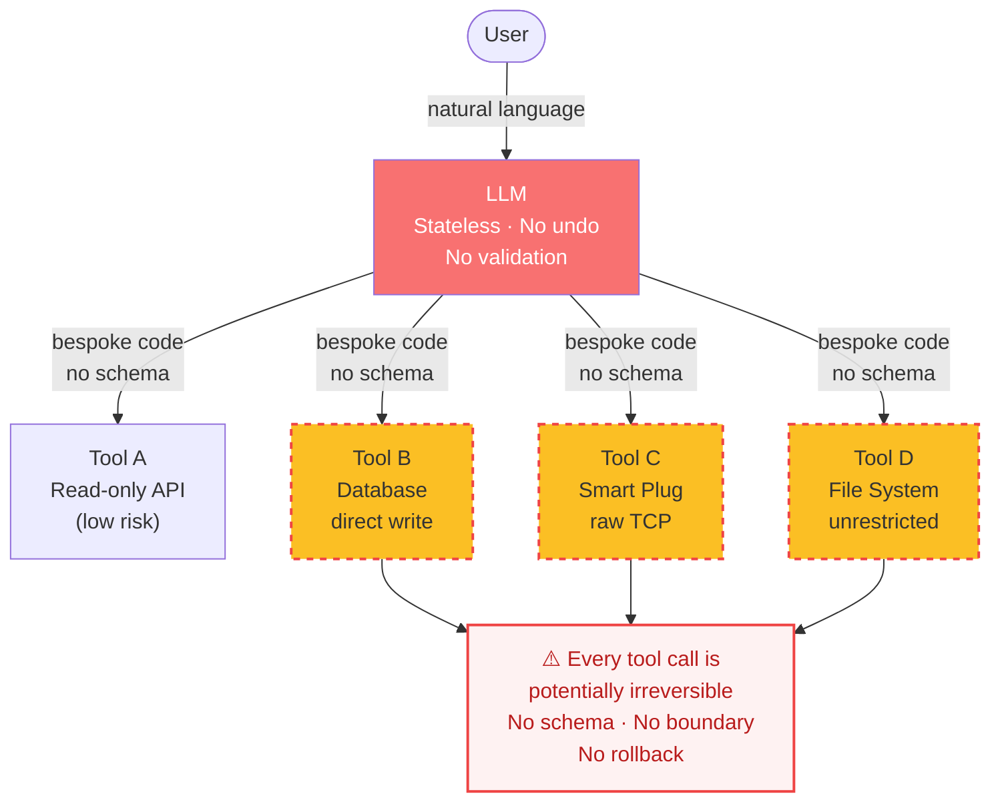
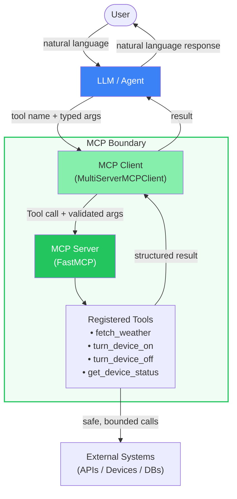
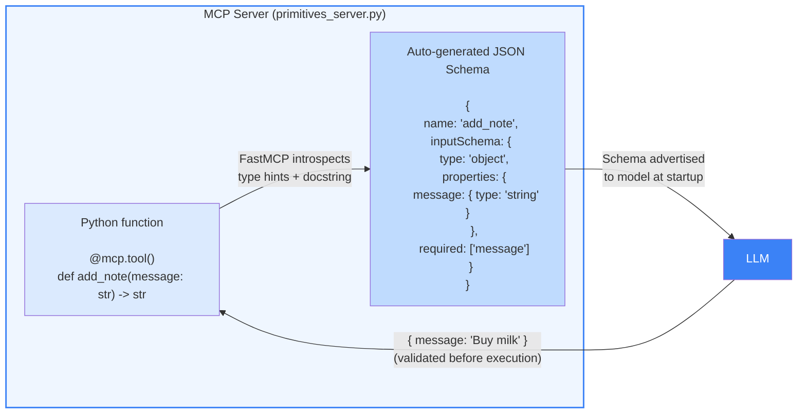
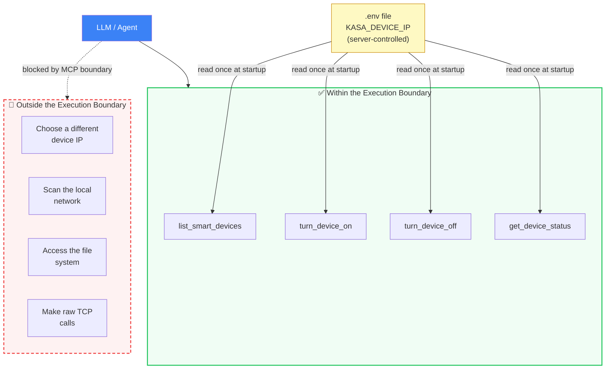
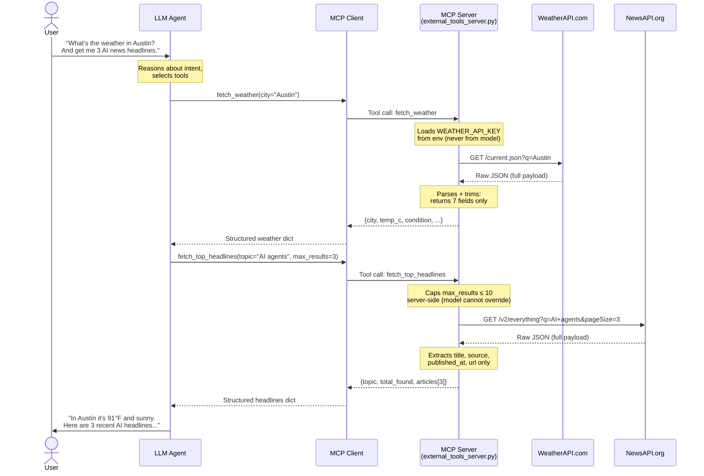
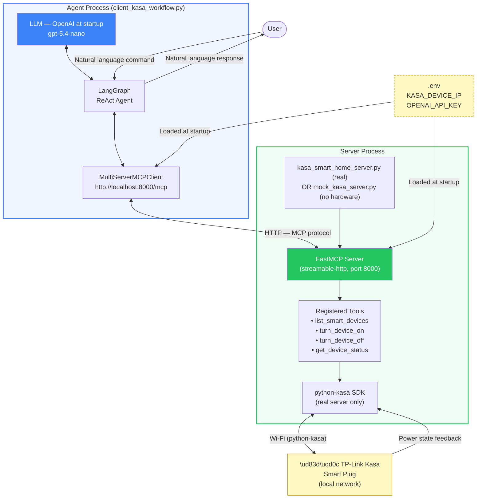
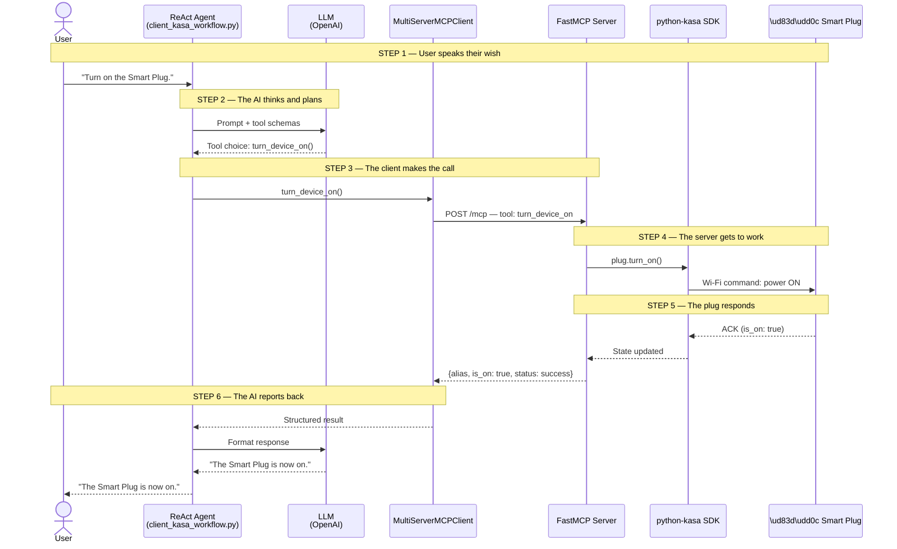
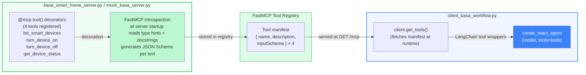

# Chapter 8 — Workflow Diagrams

This file contains Mermaid diagrams for each section of **Chapter 8: The Model Context Protocol (MCP)**.
Each diagram is self-contained and can be dropped directly into the corresponding section of the manuscript.

## Section 8.1 — Why Tool Use Needs a Standard Boundary

> **Diagram 8.1a — The Problem: No Standard Boundary**
>
> The "before" picture. An LLM that is stateless and has no undo button
> calls tools directly with bespoke code and no schema validation.
> Every call to a write-capable tool is a potential irreversible action.
> Use this to motivate why a standard protocol boundary is non-negotiable
> in production — connecting directly to §1.1 ("no undo button").

> **Diagram 8.1b — The Solution: MCP as a Standard Boundary**
>
> The "after" picture. Every tool is registered on an MCP server.
> The model only sees named tools with documented schemas;
> it cannot bypass the boundary or reach external systems directly.

---

## Section 8.2 — Schema Validation and Bounded Execution Contexts

> **Diagram 8.2a — How FastMCP Generates a JSON Schema from Python Type Hints**
>
> The path from a Python function signature to the JSON Schema the model
> receives at startup. FastMCP introspects type hints and docstrings automatically —
> the model can never pass a wrong type because the schema is enforced
> before execution, not after.

> **Diagram 8.2b — Bounded Execution: What the Model Can and Cannot Do**
>
> The execution boundary enforced by the smart home server.
> The model can call exactly the four exposed tools; it cannot discover
> other devices, change the target IP, or reach the network directly.
> The device IP is server-controlled, loaded from the environment — the
> model never sees it.

---

## Section 8.3 — Connecting Agents to External Systems Safely

> **Diagram 8.3 — Safe External API Gateway Pattern**
>
> The MCP server acts as an API gateway. The model supplies only
> user-facing arguments; the server owns auth, caps, parsing, and error
> handling before returning a clean structured response.
> Three safety annotations are shown inline: env-only keys, trimmed
> payloads, and server-side result caps.

---

## Section 8.4 — Building an MCP Server with a Smart Plug Example

> **Diagram 8.4a — End-to-End Architecture**
>
> The full system: two separate processes connected over HTTP via the MCP
> protocol. The agent process never imports python-kasa; the server process
> never imports LangGraph. The `.env` file is the only shared secret surface.
> The client uses ChatOpenAI when `OPENAI_API_KEY` is set.

> **Diagram 8.4b — Step-by-Step Request Lifecycle**
>
> Maps the six numbered steps to every participant in the stack.
> Use this alongside the code walkthrough in §8.4 to show
> exactly where the MCP protocol boundary sits in the call chain.

> **Diagram 8.4c — Four-Step Workflow: Tool Calls and Return Values**
>
> Reference table for the four `agent.ainvoke()` calls in
> `client_kasa_workflow.py`.

| Step | User instruction | Tool called | Return value |
|------|-----------------|-------------|--------------|
| 1 | "List all smart home devices" | `list_smart_devices()` | `[{alias, is_on: ?, host}]` |
| 2 | "Turn on the Smart Plug" | `turn_device_on()` | `{alias, is_on: true, status: success}` |
| 3 | "What is the status?" | `get_device_status()` | `{alias, is_on: true, status: success}` |
| 4 | "Turn off the Smart Plug" | `turn_device_off()` | `{alias, is_on: false, status: success}` |

> **Diagram 8.4d — MCP Tool Registration and Discovery**
>
> How `@mcp.tool()` decorators become a runtime tool manifest and
> reach the agent. FastMCP's introspection mechanism — not manual wiring —
> generates the JSON Schema for each tool automatically at server startup.

---

## Section 8.5 — Summary

> **Diagram 8.5 — What MCP Enforces vs. What It Does Not**
>
> A capstone reference table for the chapter summary.

| Dimension | What MCP enforces | What MCP does NOT enforce |
|-----------|-------------------|---------------------------|
| **Tool discovery** | Model sees only registered, named tools with schemas | Whether those tools are safe to call |
| **Argument types** | FastMCP validates types before execution | Business logic correctness of the arguments |
| **Auth / secrets** | API keys and device IPs live in env, never exposed to model | Rotation, expiry, or revocation of those secrets |
| **Execution scope** | Model cannot call tools outside the registered set | What the registered tools themselves can do |
| **Response shape** | Server controls what fields are returned to the model | Whether the model interprets those fields correctly |
| **Irreversibility** | Bounded — model cannot pick arbitrary targets | MCP does not add undo/rollback to write operations |

> 💡 **The gap in the last row is the bridge to Chapter 14.** MCP enforces *who* can call *what* —
> but it does not make write operations safe to retry or rollback. That requires
> the idempotency and fail-closed patterns covered in Part 4.
